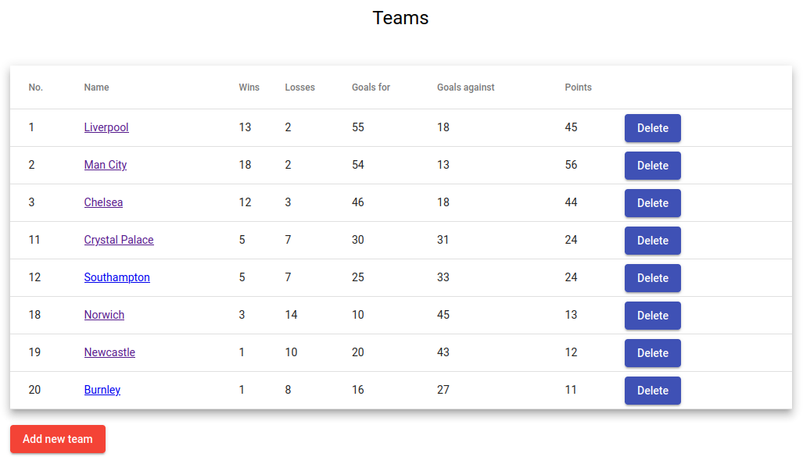
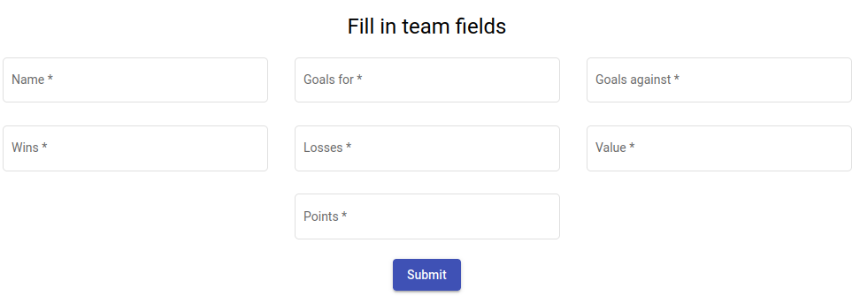
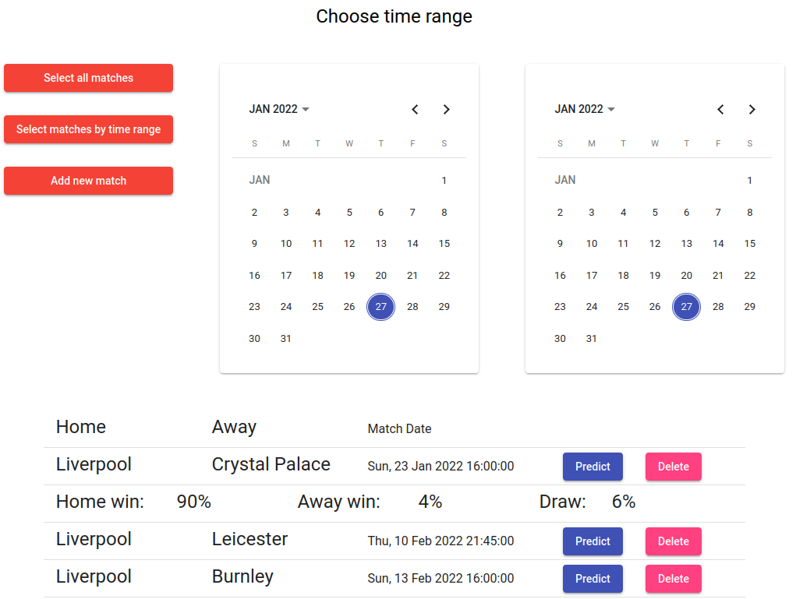

# Football matches predictions(English Premier League)
## Vision
"Football matches predictions" is web-application which allows users to register and receive predictions of football matches.

Application should provide:
  - Storing users, teams and matches in a database;
  - Display list of teams with statistics;
  - Updating the list of teams (adding and deleting);
  - Display list of matches for every team:
      - all matches;
      - matches between 2 dates;
  - Updating the list of matches (adding and deleting);
  - Display prediction for appropriate match;
  - 2 types of users:
    - admin;
    - not admin;
  - JWT tokens must be used for authentication.

***

## 1. Teams
**1.1 Display list of teams**

The mode is designed to view the list of teams and statistics for every team.

Pic 1.1 View the Teams list.

The list displays the following columns:
  - No. - team id
  - Name - team name
  - Wins - amount of wins
  - Losses - amount of losses
  - Goals for - amount of scored goals
  - Goals against - amount of conceded goals
  - Points - total amount of points

**1.2 Add team**

**Main scenario**
  - Only admin has access for managing team;
  - Admin clicks the add team button;
  - Application displays form to enter team data;
  - Admin enters team data and presses "Submit" button;
  - If entered data is valid then client sends post request to the server;
  - If new team is added successfully client redirects on the teams page;

Pic 1.2 Add team.

When adding a team, the following details are entered:
  - Name - team name
  - Wins - amount of wins
  - Losses - amount of losses
  - Goals for - amount of scored goals
  - Goals against - amount of conceded goals
  - Points - total amount of points
  - Value - team\`s market value

**1.3 Delete team**

To delete the team admin can press 'delete' button

***

## 2. Matches
**2.1 Display list of matches**

This mode is intended for viewing matches and getting predictions.

**Main scenario**
  - User presses the "Select all matches" button or chooses 2 dates and presses "Select matches by time range";
  - Application displays list of matches;
  - User presses "Predict" button and gets a prediction;

Pic 2.1 Display matches and predict.

**Filter by time range**
If user desides to fiter matches by time range he has to:
  - choose 2 dates on datepickers;
  - left date must be less than right;
  - press "Select matches by time range".

**2.2 Add match**

**Main scenario**
  - Only admin has access for managing team;
  - Admin clicks the add match button;
  - Application displays form to enter match data;
  - Admin enters team data and presses "Submit" button;
  - If entered data is valid then client sends post request to the server;
  - If new match is added successfully client redirects on the matches page;

Pic 2.2 Add match form.

When adding a match, the following details are entered:
  - Home - home team;
  - Away - away team;
  - Date - match date;

**2.3 Delete match**

To delete the match admin can press 'delete' button

***

## 3. Users
**3.1 Display list of users**

This mode is intended for viewing and managing users.

**Main scenario**
  - Only admin has access for managing users;
  - Admin clicks the 'users' button;
  - Application displays list of users with their status and subsription;
  - Admin has permission to block or subscribe users.

 

